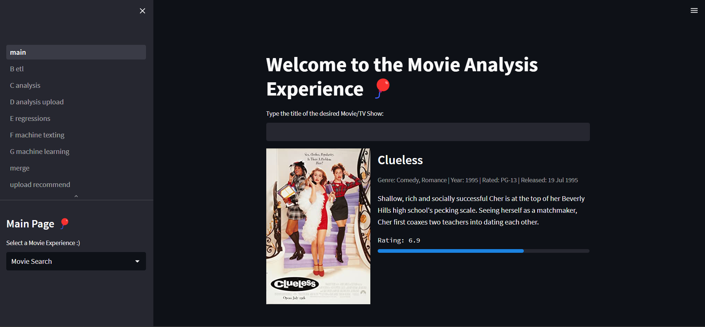
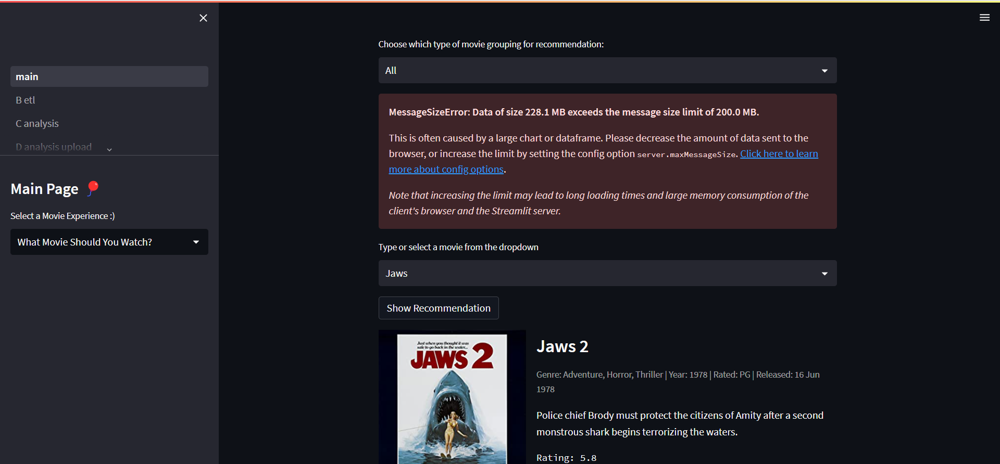
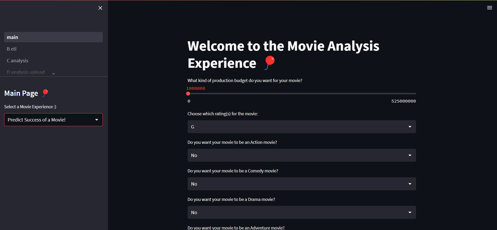
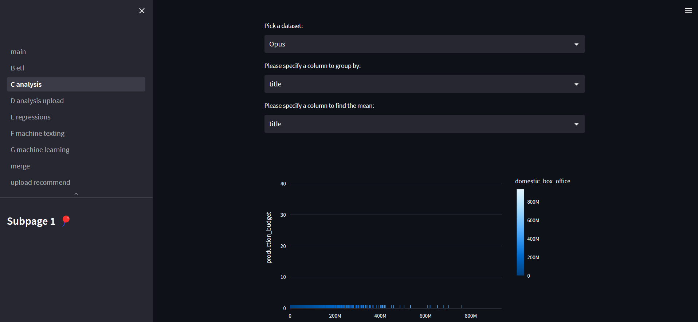
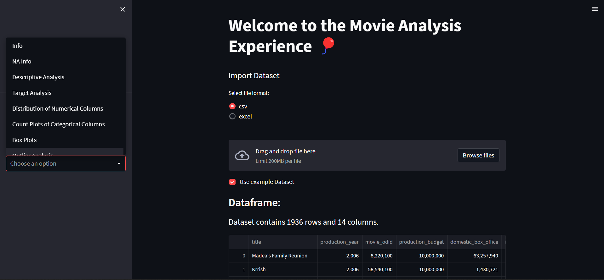
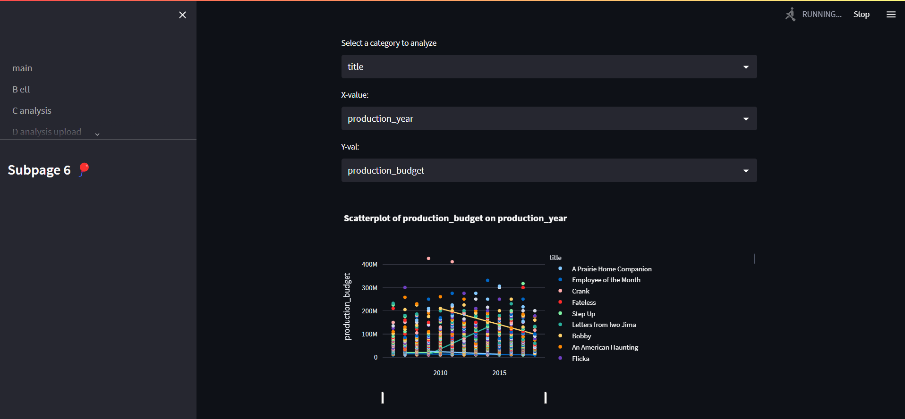
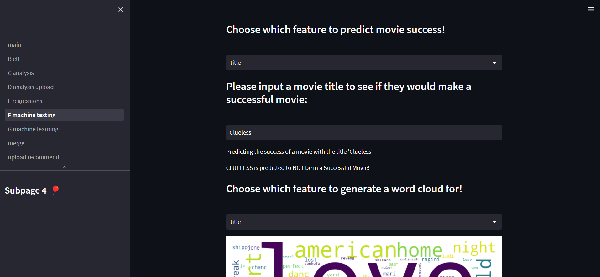
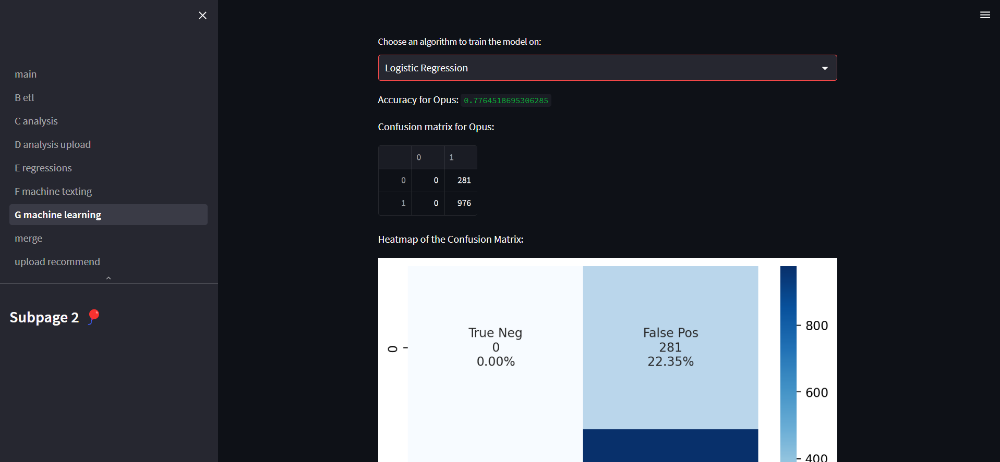

  [](https://movies123forme.streamlit.app/)

<center>
  <video style="display: auto; margin: auto; width: 600px;" controls autoplay muted loop>
    <source src="img/movies123forme_header.mp4" type="video/mp4">
  </video>
</center>

## Abstract

By looking at the emerging trends in the entertainment industry, it can be inferred that individuals are becoming increasingly interested in the deep personalization of their movie choices. Most streaming platforms now utilize different comprehensive algorithms that keep track of user’s choices, which should further perpetuate the need for unique streaming. However, the research done in thus far has only touched on the different factors affecting movie success and not the rising demand for individualization in streaming. This knowledge gap requires one to explore different ways for streaming services and other sectors of the movie industry to tailor their services for their consumers. This is where the research done in this paper comes in, where the analysis of streaming platforms (Netflix, Hulu, etc.), movie production (actors, budget, directors, etc.), and overall revenue is used to determine what exactly makes a movie successful. This paper will be a comprehensive analysis of different determinants that affect movie success, such as actors, genres, production budget, movie sales, and directors. These determinants will be analyzed with a Logistic Regression algorithm, which will then be put into a machine-learning model. Once the model is appropriately trained, then two outputs will be generated by the model. For movide industry personnel, there will be a streamlit-based application that will allow them to fill out the factors that are being determined by the model with their personal data and then output the liklihood of their movie being successful, based on movie trends determined by the model. For regular users who would like personalized movie recommendations, there will be an interface in the streamlit-run application that will allow users to input their preferred data for the movie factors, with the output being a list of all of the different movie recommendations that the model chooses, based on user preferences and movie trends.

## Installation

To run through Streamlit Cloud, simply navigate to the following [URL](https://movies123forme.streamlit.app/). If you prefer to host locally to your machine, please go through the following installation steps.

As this project relies on [Poetry](https://python-poetry.org/docs/) for dependency and package management, the way to install all necessary dependencies is by simply running the following:

```poetry install```

You should get an output similar to this once all of the packages have been downloaded to your virtual environment:

```
Installing dependencies from lock file

Package operations: 0 installs, 6 updates, 0 removals

  • Updating attrs (22.1.0 -> 22.2.0)
  • Updating numpy (1.23.5 -> 1.24.2)
  • Updating packaging (22.0 -> 23.0)
  • Updating setuptools (65.6.3 -> 66.0.0)
  • Updating charset-normalizer (2.0.4 -> 3.0.1)
  • Updating cachetools (4.2.2 -> 5.2.1)

Installing the current project: Movies123ForMe (0.1.0)
```

From there, you can run the streamlit application using the command below:

```
streamlit run src/main.py  --server.maxMessageSize=300
```

This should direct you to the homepage of the application. 



In the homepage, there are 2 different types of predictive dashboards that you can use:

- Movie Recommender
- 
---

- Predict Success of Your Own Movie
- 
---

There are multiple subpages included in the application, as well as different features that can be explored on each subpage. These are the different subpages offered:

- Analysis subpage:
- 
---

- Analysis upload subpage:
- 
---

- Regressions subpage:
- 
---

- Machine Texting subpage:
- 
---

- Machine Learning subpage:
- 
